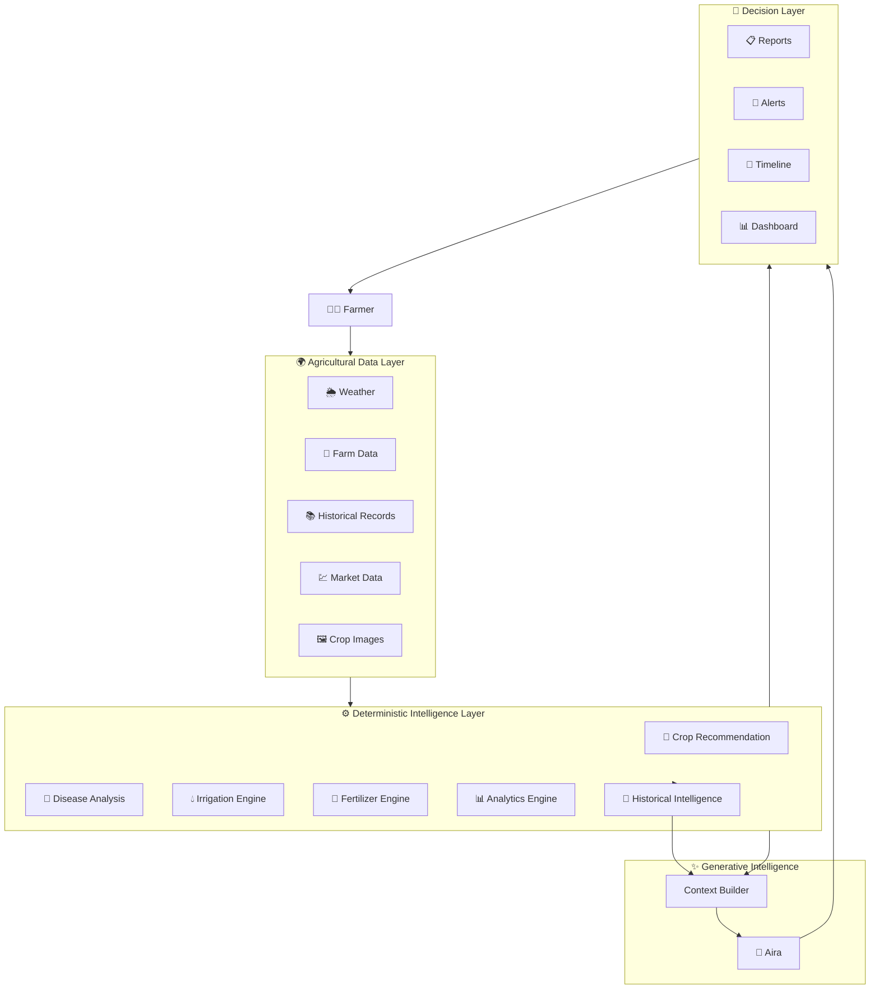
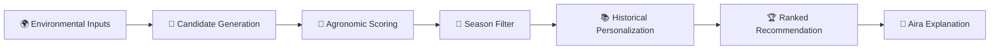
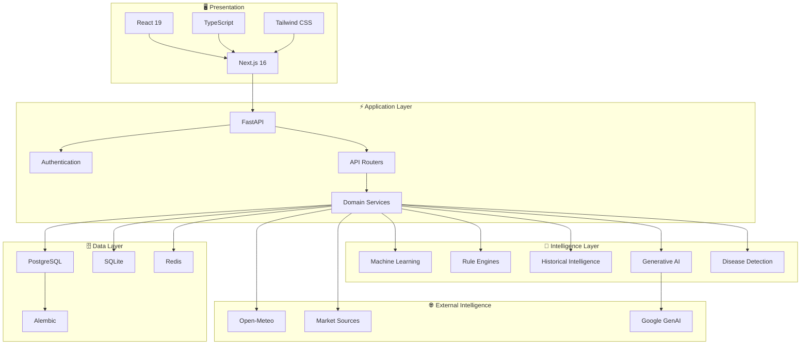
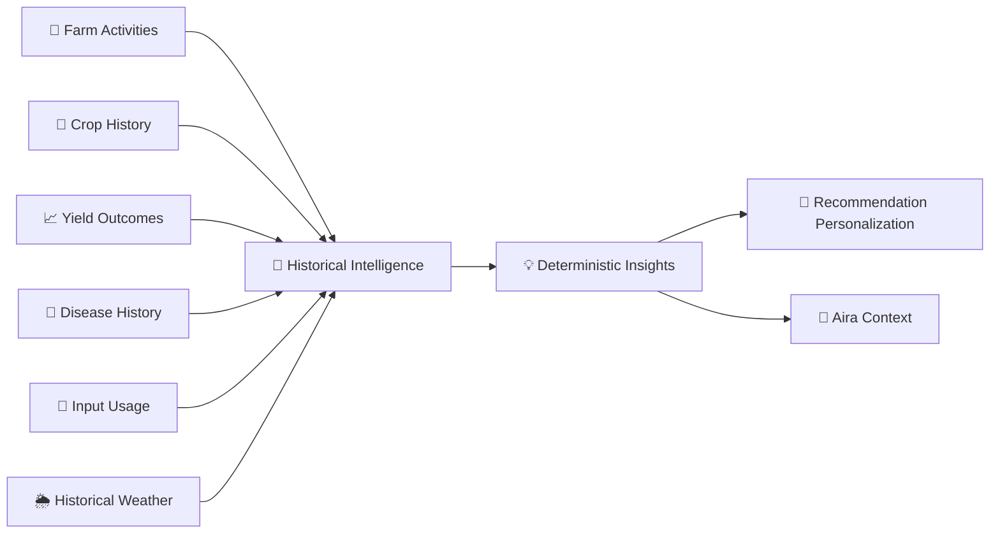
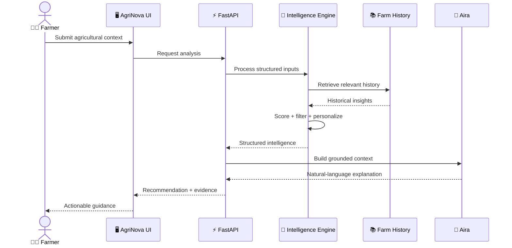

<div align="center">

# 🌱 AgriNova AI

### **From fragmented farm data to a unified intelligence layer for modern agriculture.**

**Observe · Understand · Decide · Cultivate**

<p>
  
  
  
  
</p>

<p>
  
  
  
  
  
</p>

<br>

> ### 🌾 **Agriculture generates enormous amounts of data.**
> ### **AgriNova turns that data into decisions.**

</div>

---

##  What is AgriNova?

**AgriNova AI** is a precision-agriculture intelligence platform designed to bring the fragmented pieces of modern farming into one intelligent workspace.

Instead of treating weather, crop recommendations, disease detection, irrigation, fertilizer, farm history, market conditions, and AI assistance as separate tools, AgriNova connects them into a **context-aware agricultural intelligence layer**.

<div align="center">

| 🌦️ Observe | 🧠 Understand | 🎯 Decide | 🌱 Act |
|:---:|:---:|:---:|:---:|
| Weather & environment | Historical intelligence | Recommendations | Farm actions |
| Crop conditions | Farm performance | Risk signals | Irrigation |
| Market movement | Disease patterns | Market intelligence | Fertilization |
| Farm activity | Seasonal context | AI explanations | Crop planning |

</div>

---

# ✨ Product Showcase

> **The interface is designed as an agricultural command center — not a collection of disconnected dashboards.**

### 🏡 Home — Agricultural Command Center

<!-- Replace with:  -->

<div align="center">

**📸 HOME / DASHBOARD SCREENSHOT**

`Your farm intelligence at a glance`

</div>

---

### 🤖 Aira — AI Agricultural Intelligence

<!-- Replace with:  -->

<div align="center">

**📸 AIRA SCREENSHOT**

`A context-aware agricultural copilot grounded in structured farm intelligence`

</div>

---

### 🦠 Crop Disease Detection

<!-- Replace with:  -->

<div align="center">

**📸 DISEASE DETECTION SCREENSHOT**

`Identify crop-health risks and surface actionable guidance`

</div>

---

### 💹 Market Intelligence

<!-- Replace with:  -->

<div align="center">

**📸 MARKET INTELLIGENCE SCREENSHOT**

`Turn market signals into better crop and selling decisions`

</div>

---

# 🌾 Intelligence Modules

<table>
<tr>
<td width="50%" valign="top">

### 🌱 Intelligent Crop Recommendation
Evidence-driven crop selection using:
- Soil & environmental conditions
- Weather context
- Seasonal suitability
- ML predictions
- Deterministic agronomic scoring
- Historical farm performance

</td>
<td width="50%" valign="top">

### 🤖 Aira — AI Agricultural Intelligence
Aira sits above the intelligence layer and translates structured agricultural context into understandable recommendations, explanations, and guidance.

</td>
</tr>

<tr>
<td width="50%" valign="top">

### 🦠 Disease Detection & Crop Health
A dedicated disease-analysis pipeline combines image processing, detection infrastructure, symptom knowledge, and structured agricultural context.

</td>
<td width="50%" valign="top">

### 🌦️ Weather Intelligence
Current and historical weather context powers crop decisions, irrigation reasoning, environmental analysis, and agricultural planning.

</td>
</tr>

<tr>
<td width="50%" valign="top">

### 💧 Irrigation Intelligence
Irrigation guidance combines crop requirements, environmental conditions, and historical farm context to produce practical recommendations.

</td>
<td width="50%" valign="top">

### 🧪 Fertilizer Intelligence
Fertilizer recommendations incorporate crop requirements and historical signals rather than treating every farm as identical.

</td>
</tr>

<tr>
<td width="50%" valign="top">

### 📈 Farm Analytics
Track farm performance, crop outcomes, activity history, and historical patterns to transform raw farm records into usable intelligence.

</td>
<td width="50%" valign="top">

### 💹 Market Intelligence
Market data, pricing signals, and alerts help connect cultivation decisions with economic conditions.

</td>
</tr>

<tr>
<td width="50%" valign="top">

### 🌿 Crop Lifecycle & Timeline
A structured crop timeline provides visibility into cultivation activities, stages, events, and farm history.

</td>
<td width="50%" valign="top">

### 🔔 Alerts & Notifications
Surface important agricultural events through a centralized notification and alerting layer.

</td>
</tr>
</table>

---

# 🧠 The Intelligence Architecture

AgriNova is intentionally **not** just an LLM wrapper.

Its architecture separates **facts, intelligence, and communication**.



### 🔑 Core Principle

<div align="center">

> **Deterministic systems establish the facts.**  
> **Historical intelligence establishes the context.**  
> **Generative AI communicates the result.**

</div>

This separation keeps recommendations explainable, testable, and grounded while still giving farmers a natural conversational interface.

---

# 🧬 How a Recommendation Evolves

A recommendation is not simply:

`Input → LLM → Answer`

Instead, AgriNova follows a layered decision pipeline.



### Example

```text
Farmer Context
     │
     ├── Temperature
     ├── Rainfall
     ├── Humidity
     ├── Soil conditions
     ├── Season
     └── Farm history
            │
            ▼
     Candidate Generation
            │
            ▼
     Environmental Scoring
            │
            ▼
       Season Filter
            │
            ▼
   Historical Personalization
            │
            ▼
    Ranked Crop Candidates
            │
            ▼
       Aira Explanation
```

The result is a system where AI can **explain a decision without being solely responsible for inventing it**.

---

# 🏗️ System Architecture



---

# 🧩 Platform Surface

```text
┌─────────────────────────────────────────────────────────────────┐
│                         🌱 AGRINOVA AI                          │
├─────────────────────────────────────────────────────────────────┤
│                                                                 │
│  🏡 Home          🤖 Aira             🌦️ Weather                │
│                                                                 │
│  🌱 Crop AI       🦠 Disease          💹 Market                 │
│                                                                 │
│  🌿 Timeline      🚜 Farms            📊 Analytics               │
│                                                                 │
│  📚 Knowledge     ⚙️ Settings         🔔 Alerts                 │
│                                                                 │
└─────────────────────────────────────────────────────────────────┘
```

---

# 🔬 Intelligence Stack

### 01 · Perception

AgriNova observes the agricultural environment through structured and unstructured inputs.

**Weather · farm records · crop images · market signals · historical activity**

↓

### 02 · Reasoning

Specialized engines transform raw inputs into structured intelligence.

**ML models · rules · filters · scoring · historical analysis**

↓

### 03 · Context

Historical intelligence adds the missing dimension:

> **“What has happened on this farm before?”**

This enables recommendations to become increasingly contextual instead of remaining generic.

↓

### 04 · Communication

Aira translates structured intelligence into natural-language guidance.

**Facts → Context → Explanation → Action**

---

# 📚 Historical Farm Intelligence

One of AgriNova's differentiators is its ability to treat farm history as a first-class intelligence source.



Historical intelligence can identify patterns such as:

- Crop performance over time
- Seasonal behavior
- Yield trends
- Recurrent disease patterns
- Input usage
- Farm activity history
- Weather relationships
- Recommendation personalization

**Farm isolation is treated as a core requirement**, ensuring historical context belongs to the correct farm and user.

---

# 🤖 Aira

<div align="center">

### **Aira is not the intelligence layer.**
### **Aira is the interface to the intelligence layer.**

</div>

Aira consumes structured context produced by AgriNova's deterministic systems and turns it into human-readable agricultural guidance.

```text
                 ┌──────────────────────┐
                 │  Agricultural Data   │
                 └──────────┬───────────┘
                            ↓
                 ┌──────────────────────┐
                 │ Deterministic Logic │
                 └──────────┬───────────┘
                            ↓
                 ┌──────────────────────┐
                 │ Historical Context  │
                 └──────────┬───────────┘
                            ↓
                 ┌──────────────────────┐
                 │    Context Builder  │
                 └──────────┬───────────┘
                            ↓
                 ┌──────────────────────┐
                 │       🤖 Aira        │
                 └──────────┬───────────┘
                            ↓
                 ┌──────────────────────┐
                 │ Natural Explanation │
                 └──────────────────────┘
```

This architecture gives Aira access to **grounded agricultural context rather than an empty chat box**.

---

# 🧪 Engineering Philosophy

| Principle | What it means |
|---|---|
| 🧠 **Grounded AI** | AI responses are built around structured agricultural context |
| 📐 **Deterministic First** | Critical decisions have explicit logic and scoring |
| 📚 **Historical Context** | Farm history influences future recommendations |
| 🔒 **Farm Isolation** | Agricultural data remains scoped to its farm/user |
| 🧩 **Modular Services** | Domain logic is separated into focused services |
| 🧪 **Testable Intelligence** | Recommendation logic can be validated independently |
| 🔌 **Provider Agnostic** | External intelligence providers can be swapped |
| ⚡ **Async by Design** | Backend services are designed around asynchronous I/O |

---

# 🛠️ Technology Stack

<div align="center">

| Layer | Technologies |
|:---|:---|
| 🎨 **Frontend** | Next.js 16 · React 19 · TypeScript · Tailwind CSS 4 |
| ⚡ **Backend** | FastAPI · Python · Pydantic v2 |
| 🗃️ **Database** | PostgreSQL · SQLite · SQLAlchemy 2 |
| 🔄 **Migrations** | Alembic |
| 🧠 **Machine Learning** | scikit-learn · NumPy · Pandas · Joblib |
| 🤖 **Generative AI** | Google GenAI |
| 🌦️ **Weather** | Open-Meteo |
| ⚡ **Caching / Infrastructure** | Redis |
| 🔐 **Security** | JWT · bcrypt · password hashing |
| 🧪 **Testing** | Pytest · Pytest-asyncio |
| 🚀 **Deployment** | Modern container / cloud-ready architecture |

</div>

---

# 📂 Repository Architecture

```text
AgriNova-AI/
│
├── backend/
│   ├── app/
│   │   ├── ai/
│   │   │   ├── prompts/
│   │   │   ├── providers/
│   │   │   ├── schemas/
│   │   │   └── services/
│   │   │
│   │   ├── api/
│   │   ├── core/
│   │   ├── db/
│   │   ├── models/
│   │   ├── repositories/
│   │   ├── routers/
│   │   └── services/
│   │       ├── analytics_service.py
│   │       ├── crop_service.py
│   │       ├── disease_service.py
│   │       ├── fertilizer_service.py
│   │       ├── irrigation_service.py
│   │       ├── market_service.py
│   │       ├── notification_service.py
│   │       ├── report_service.py
│   │       ├── scheduler_service.py
│   │       ├── timeline_service.py
│   │       └── weather_service.py
│   │
│   ├── alembic/
│   └── requirements.txt
│
├── frontend/
│   ├── src/
│   │   ├── app/
│   │   ├── components/
│   │   ├── lib/
│   │   └── ui/
│   └── package.json
│
├── data/
├── README.md
└── RELEASE_NOTES.md
```

---

# 🚀 Getting Started

## 1. Clone

```bash
git clone https://github.com/shaheeq27/AgriNova-AI.git
cd AgriNova-AI
```

## 2. Backend

```bash
cd backend

python -m venv .venv
source .venv/bin/activate

pip install -r requirements.txt

uvicorn app.main:app --reload
```

## 3. Frontend

```bash
cd frontend

npm install
npm run dev
```

The development application will be available through the local frontend server.

---

# 🔐 Environment Configuration

Create the required environment configuration for your local deployment.

Typical configuration includes:

```env
DATABASE_URL=
SECRET_KEY=
REDIS_URL=

GOOGLE_API_KEY=
GEMINI_API_KEY=

WEATHER_API_URL=
```

> ⚠️ Never commit real API keys, database credentials, or secrets to the repository.

---

# 📊 Product Flow



---

# 🌱 Why AgriNova?

Traditional agricultural software often behaves like a set of disconnected utilities:

```text
Weather App       → Weather
Crop Calculator   → Crop
Disease Tool      → Disease
Market Website    → Prices
AI Chatbot        → Answers
```

AgriNova aims for something different:

```text
                     🌱 AGRINOVA AI
                           │
       ┌───────────────────┼───────────────────┐
       │                   │                   │
   🌦️ Environment      📚 History          💹 Market
       │                   │                   │
       └───────────────────┼───────────────────┘
                           │
                    🧠 Intelligence
                           │
                    ┌──────┴──────┐
                    │             │
                 ⚙️ Engines     🤖 Aira
                    │             │
                    └──────┬──────┘
                           │
                     🎯 Decisions
                           │
                      👨‍🌾 Farmer
```

The goal is not to create another agricultural dashboard.

**The goal is to create an agricultural decision layer.**

---

# 🗺️ Roadmap Philosophy

AgriNova evolves around one central question:

> **How can software understand enough agricultural context to help a farmer make a better decision?**

Future intelligence can progressively connect:

```text
🌦️ Weather
   ↓
🌱 Crop
   ↓
🦠 Health
   ↓
💧 Irrigation
   ↓
🧪 Fertilizer
   ↓
📈 Yield
   ↓
💹 Market
   ↓
📚 Historical Learning
   ↓
🤖 Agricultural Intelligence
```

The long-term direction is a platform where every agricultural decision becomes increasingly **contextual, explainable, and data-informed**.

---

# 🏆 Project Status

<div align="center">

### 🚧 Active Development

**AgriNova AI is an evolving precision-agriculture intelligence platform.**

<br>

| Area | Status |
|:---:|:---:|
| 🌱 Crop Recommendation | 🟢 Active |
| 🤖 Aira | 🟢 Active |
| 🦠 Disease Detection | 🟢 Active |
| 🌦️ Weather Intelligence | 🟢 Active |
| 💧 Irrigation Intelligence | 🟢 Active |
| 🧪 Fertilizer Intelligence | 🟢 Active |
| 📚 Historical Intelligence | 🟢 Active |
| 💹 Market Intelligence | 🟢 Active |
| 📊 Farm Analytics | 🟢 Active |
| 🔔 Notifications | 🟢 Active |

</div>

---

# 👨‍💻 Built With

<div align="center">

**Python · FastAPI · SQLAlchemy · PostgreSQL · Redis · scikit-learn · Pandas · NumPy · Next.js · React · TypeScript · Tailwind CSS · Google GenAI · Open-Meteo**

</div>

---

# 🌍 The Bigger Picture

Agriculture is not a single-variable problem.

A crop decision can depend on:

**weather + soil + season + crop history + disease risk + irrigation + fertilizer + market conditions + previous outcomes.**

AgriNova is built around the belief that the next generation of agricultural software should not merely **display data**.

It should **connect context, reason over it, and help people act on it.**

<div align="center">

## 🌱 **AgriNova AI**

### *Observe. Understand. Decide. Cultivate.*

<br>

**Precision agriculture, powered by intelligence.**

</div>

---

<div align="center">

⭐ If you find the project interesting, consider giving the repository a star.

</div>
